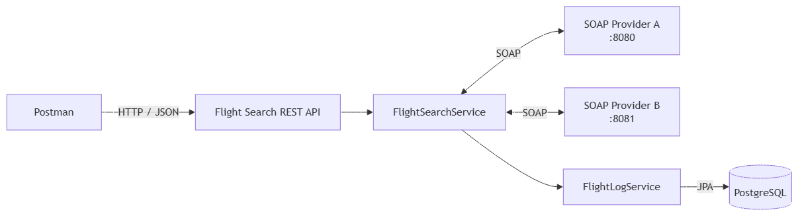

# Uçuş Arama Servisi

Bu proje, iki farklı SOAP uçuş sağlayıcısından alınan sonuçları tek bir REST API üzerinden sunan bir case çalışmasıdır. REST uygulaması sağlayıcı cevaplarını ortak bir modele dönüştürür; tüm uçuşları birleştirir veya aynı uçuşlar arasından en ucuz olanı seçer. REST servislerinin istek ve cevapları PostgreSQL'e kaydedilir.

## Proje yapısı

```text
flightProviders/
├── flight-provider-a-soap
├── flight-provider-b-soap
└── flight-search-rest
```

| Modül | Açıklama | Port |
|---|---|---:|
| `flight-provider-a-soap` | Provider A SOAP servisi | 8080 |
| `flight-provider-b-soap` | Provider B SOAP servisi | 8081 |
| `flight-search-rest` | SOAP servislerini tüketen REST API | 8082 |

## Kullanılan teknolojiler

- Java 17
- Spring Boot 4
- Spring Web MVC
- Spring Web Services
- JAXB ve XSD
- Spring Data JPA
- PostgreSQL

## Mimari



```text
İstemci
   │ JSON
   ▼
flight-search-rest
   ├── SOAP/XML ──► flight-provider-a-soap
   └── SOAP/XML ──► flight-provider-b-soap
```

SOAP XML mesajları JAXB ile generated Java sınıflarına dönüştürülür. Provider A ve Provider B'nin farklı cevap modelleri mapper sınıfları aracılığıyla ortak `FlightDto` modeline çevrilir. REST cevapları Jackson tarafından JSON olarak üretilir.

## SOAP servisleri

Provider A:

```text
Endpoint: http://localhost:8080/ws
WSDL:     http://localhost:8080/ws/flights.wsdl
```

Provider B:

```text
Endpoint: http://localhost:8081/ws
WSDL:     http://localhost:8081/ws/flights.wsdl
```

Her iki sağlayıcı da mevcut `availabilitySearch` iş mantığını SOAP endpoint olarak sunar. Servis sözleşmeleri XSD ile tanımlanmış, SOAP taşıma sınıfları JAXB Maven Plugin ile üretilmiştir.

## REST endpointleri

### Tüm uçuşları getir

```http
POST /api/flights/search
Content-Type: application/json
```

Provider A ve Provider B sonuçlarını tek listede birleştirir.

### En ucuz uçuşları getir

```http
POST /api/flights/cheapest
Content-Type: application/json
```

Uçuşları aşağıdaki alanlara göre gruplar ve her gruptaki en düşük fiyatlı uçuşu döndürür:

- Uçuş numarası
- Kalkış yeri
- Varış yeri
- Kalkış tarih ve saati
- Varış tarih ve saati

### Örnek istek

```json
{
  "origin": "IST",
  "destination": "COV",
  "departureDate": "2026-09-10T09:00:00"
}
```

## Veritabanı ve ortam değişkenleri

Önce PostgreSQL'de veritabanını oluşturun:

```sql
CREATE DATABASE flight_case;
```

`flight-search-rest/.env.example` dosyasını `.env` adıyla kopyalayın ve kendi PostgreSQL bilgilerinizi girin:

```env
DB_URL=jdbc:postgresql://localhost:5432/flight_case
DB_USERNAME=postgres
DB_PASSWORD=your_password
```

Gerçek `.env` dosyası Git'e dahil edilmez.

REST servislerinin her isteği için aşağıdaki bilgiler `flight_search_logs` tablosuna kaydedilir:

- Endpoint
- Request payload
- Response payload
- Başarı durumu
- Hata mesajı
- Oluşturulma zamanı

## Çalıştırma

Uygulamaları aşağıdaki sırayla, ayrı terminallerde çalıştırın.

### 1. Provider A

```powershell
cd flight-provider-a-soap
mvn spring-boot:run
```

### 2. Provider B

```powershell
cd flight-provider-b-soap
mvn spring-boot:run
```

### 3. REST uygulaması

```powershell
cd flight-search-rest
mvn spring-boot:run
```

Ardından REST API'ye şu adresten erişilebilir:

```text
http://localhost:8082
```

## Testler

Her modül kendi dizininde test edilebilir:

```powershell
mvn clean test
```

Testler mapper dönüşümlerini ve aynı uçuşlar arasından en düşük fiyatlı olanın seçilmesini doğrular.
